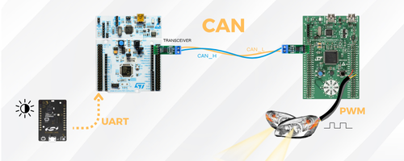

# Automatic Car Headlights Control System

## Overview

This project implements an automatic headlights system for cars, controlling daytime running lights, low beam, and high beam LEDs. It uses three microcontrollers working together:

- **EFR32**: Reads ambient light sensor via I2C and sends data via UART.  
- **STM32F4 Nucleo**: Receives sensor data, decides headlights mode, and sends commands via CAN.  
- **STM32F3 Discovery**: Controls LED headlights using PWM based on CAN commands.

## Features

- Ambient light sensing and processing  
- Multi-MCU communication using UART, CAN, and I2C  
- PWM control for LED headlights  
- Uses STM32 HAL library for peripheral management

## Project Structure

- `/stm32f4xx`    : STM32F4 firmware  
- `/stm32f3xx`    : STM32F3 firmware  
- `/efr32`        : EFR32 firmware  
- `/img`         : Project illustrations

## Build & Flash

- STM32 MCUs: Build with STM32CubeIDE, flash with ST-Link  
- EFR32: Build and flash with Silicon Labs tools  

## Communication Flow

EFR32 (I2C sensor) → UART → STM32F4 (decision) → CAN → STM32F3 (PWM LED control)

---

Contributions welcome!

License: **Silicon Labs Master Software License Agreement (MSLA)**